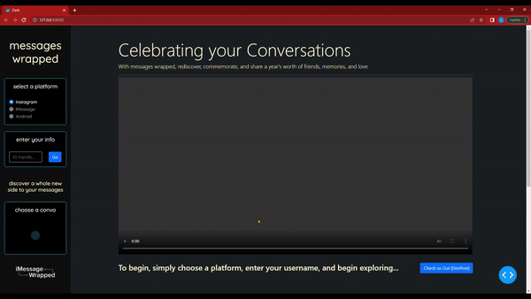
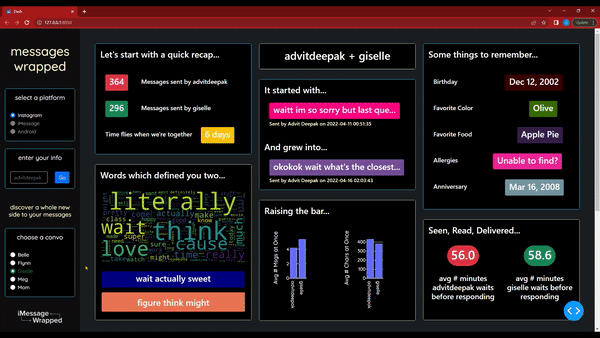

# messages wrapped

> trouble remembering birthdays, anniversaries, or more? messages-wrapped utilizes NLP to parse, analyze, and store data from your DMs, curating and commemorating each text, memory, and relationship (inspired by Spotify Wrapped, LA Hacks Spring '22)

&nbsp;&nbsp;

Let’s face it: *we’re not all great listeners*. With a world of information to keep track of, we can’t expect ourselves to remember *every* birthday, address, or favorite food. Yet, showing loved ones that you can remember small details about them makes them feel heard. 

***messages wrapped*** is here to help! Employs machine learning and natural language processing, ***messages wrapped***  extracts, analyzes, and stores information directly from your direct messages. We created it in hopes that we would never have to send another dreaded belated birthday text or have to ask for a close friend’s dietary restrictions *again*. 

While our original idea had stopped here, our final concept has evolved into a fully-fledged statistical summary of a user’s direct messages. Inspired by Spotify’s annual *“Wrapped on Spotify”*, our team has included a multitude of features including contacts ranked by message frequency, group chat activity, average response time, word boards, and more. 

&nbsp;&nbsp;

## Demos (login, switch)

Here, we login via Instagram and choose a given DM to view it's dashboard summary. 

Here, we can switch between DMs to compare the metrics between different individuals.

&nbsp;&nbsp;

## Usage 

Currently, only Instagram is stable as a source of input for 'messages-wrapped'. Please move any downloaded <recipient>.json files into the `sample` folder. Then, run `python main.py` in order to start the Dash app and NLTK modules. A list of required conda installations can be found in `main.py`. 

&nbsp;&nbsp;

## What’s Next

In the future, we would like to expand ***Messages Wrapped*** to other messaging platforms like whatsapp, telegram, discord, WeChat, etc. We would add several interactive features, similar to Spotify Wrapped’s two truths and a lie game, enabling the users to better engage with and understand their messaging statistics. We would also use BERT to implement a search feature that accepts a word or phrase input and returns the message sender’s name and number, and the date and time of when the message was sent or received. 

